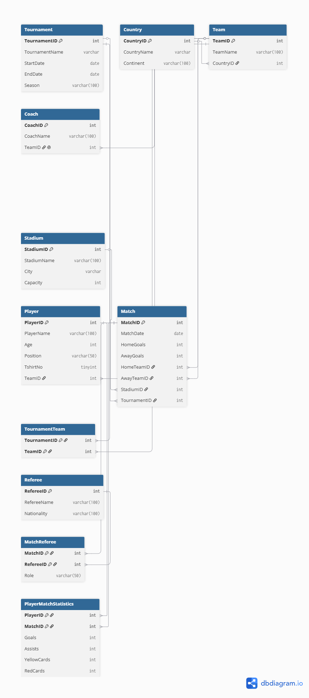
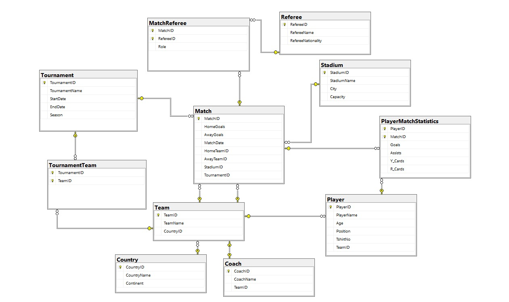
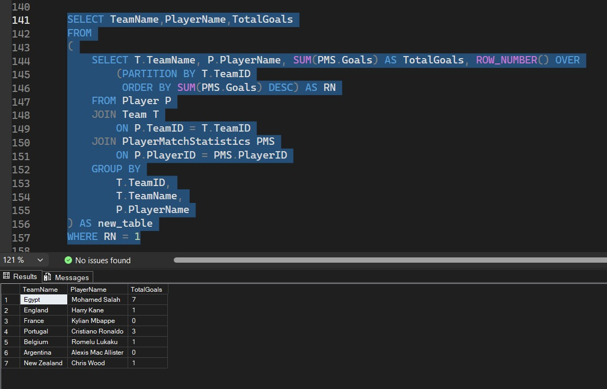
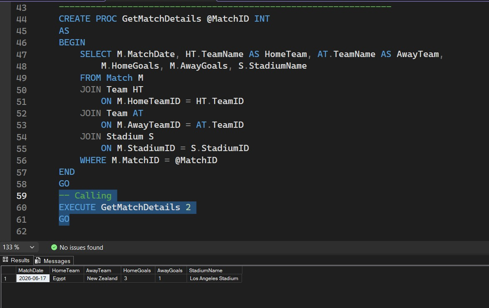
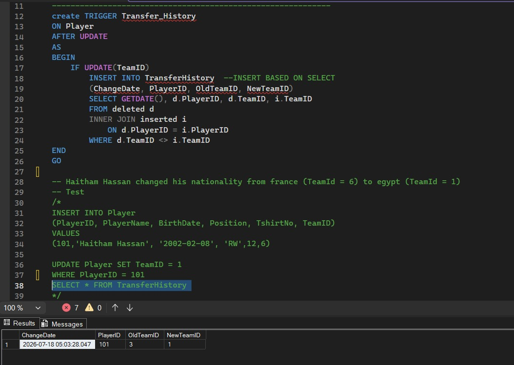

# Football Tournament Management System Database

## Description
A SQL Server database project for managing football tournaments (e.g., FIFA World Cup), teams, players, matches, referees, stadiums, and player statistics.

## SQL Concepts Used
This project demonstrates practical database design concepts including normalization, relationships, constraints, Joins, Aggregate Functions, GROUP BY, HAVING, Subqueries, views, functions, stored procedures, triggers, and indexing.

## Technologies
- SQL Server Management Studio (SSMS)
- T-SQL
- Git
- GitHub

## Features
- Database Design using SQL Server
- Relational Database with Foreign Keys
- Constraints & Data Validation
- Views
- Scalar Functions
- Table-Valued Functions
- Stored Procedures
- Triggers
- Indexes
- Database Documentation
- Sample Queries
- Audit Logging using Triggers
- Entity Relationship Diagram (ERD)

## 📂 Project Structure

```text
Football-Management-System-Database
│
├── Database
│   ├── 01_Create_Database.sql
│   ├── 02_Create_Table.sql
│   ├── 03_Drop_Tables.sql
│   ├── 04_Insert_Data.sql
│   ├── 05_Queries.sql
│   ├── 06_Functions.sql
│   ├── 07_Index.sql
│   ├── 08_View.sql
│   ├── 09_Stored_Procedure.sql
│   └── 10_Triggers.sql
│
├── Docs
│   ├── Entities.md
│   └── System_Analysis.md
│
├── ERD
│   ├── ERD.dbml
│   └── ERD.png
│
├── Screenshots
│   ├── 01_Table_Diagram.jpeg
│   ├── 02_Queries.jpeg
│   ├── 03_Stored_Procedure.jpeg
│   └── 04_Trigger.jpeg
│
└── README.md
```
## Database Entities
- Country
- Team
- Coach
- Player
- Tournament
- TournamentTeam
- Stadium
- Match
- Referee
- MatchReferee
- PlayerMatchStatistics
- TransferHistory

## 📸 Screenshots
## Entity Relationship Diagram


## Database Diagram


## Sample Queries


## Stored Procedures


## Triggers


## Author

**Omar Ahmed**

Faculty of Engineering

GitHub:
[omar-ahmed62](https://github.com/omar-ahmed62)

LinkedIn:
[Omar Ahmed Salah](https://www.linkedin.com/in/omarahmedsalah)